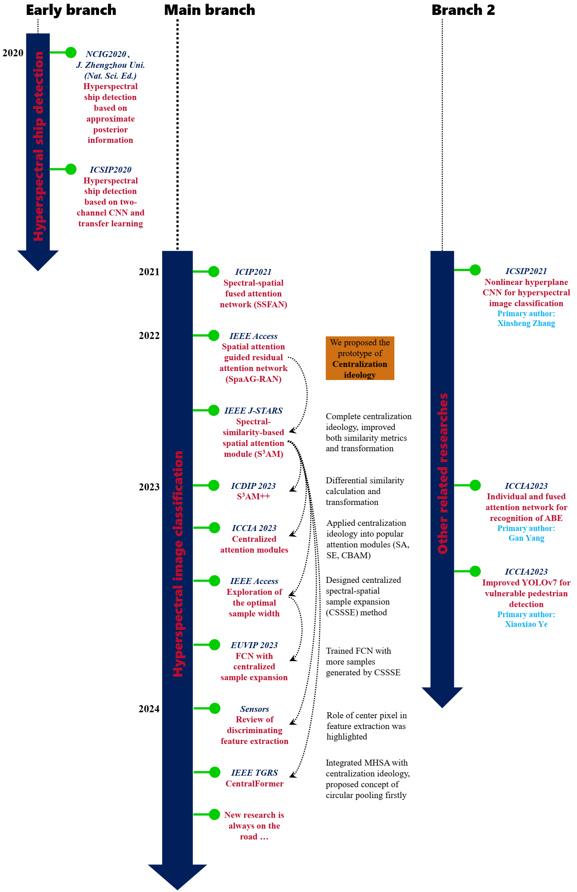

Education
======

- **Master**  
2019.09.09--2023.06.30  Software Engineering, Hainan University (HNU), Haikou, China  
- **Exchange student**🌲🌲⛰️🌲🏫🏪🌲⛰️🌊🌲🌲  
2022.03.15--2022.09.30  Department of Computer Science, Norges Teknisk-Naturvitenskapelige Universitet (NTNU), Gjøvik, Norway  
- **Bachelor**  
2015.09.07--2019.06.27  Remote Sensing Science and Technology, Henan Polytechnic University (HPU), Jiaozuo, China

<!--Unreachable ntnu Ph.D.  
======
- 2022.12.19--2024.04.29  
I passed the NTNU Ph.D. interview on Dec. 19, 2022 and then waited for the result of final qualification review.  
Until Apr. 29, 2024, I was told that the Ph.D. position was cancelled by the dean because of the serious relationship between China and Norway.-->

<!--Work
======
- 2024.06.08--Present  
Hainan Aerospace Information Research Institute, Wenchang-->

Research interests
======
- Image processing
- Deep learning
- Remote sensing
- Hyperspectral image classification
- Attention mechanism

Overview of my researches
======
  

Publications
======
**Journal articles**
1. CentralFormer: Centralized spectral-spatial transformer for hyperspectral image classification with adaptive relevance estimation and circular pooling [:rocket:](https://ieeexplore.ieee.org/document/10772042) [:octopus:](https://github.com/ningyang-li/CentralFormer)  
**N. Li**, Z. Wang, F. A. Cheikh, L. Wang, ***IEEE Transactions on Geoscience and Remote Sensing (TGRS)***, vol. 62, pp. 1-16, 2024, Art no. 5540716. (SCI Q1, IF: 7.5)
2. Discriminating spectral-spatial feature extraction for hyperspectral image classification: A review [:rocket:](https://www.mdpi.com/1424-8220/24/10/2987)  
**N. Li**, Z. Wang, F. A. Cheikh, ***Sensors***, vol. 24, no. 10, pp. 2987, 2024. (SCI Q2, IF: 3.9)
3. An exploration on the influence factors of the optimal sample width for hyperspectral remote sensing image classification [:rocket:](https://ieeexplore.ieee.org/document/10318097/)  
**N. Li**, Z. Wang, F. A. Cheikh, M. Ullah, ***IEEE Access***, vol. 11, pp. 128667-128680, 2023. (SCI Q2, IF: 3.9)
4. S3AM: A spectral-similarity-based spatial attention module for hyperspectral image classification [:rocket:](https://ieeexplore.ieee.org/document/9832463) [:octopus:](https://github.com/ningyang-li/S3AM-Net)  
**N. Li**, Z. Wang, F. A. Cheikh, M. Ullah, ***IEEE Journal of Selected Topics in Applied Earth Observation and Remote Sensing (J-STARS)***, vol. 15, pp. 5984-5998, 2022. (SCI Q1, IF: 4.715)
5. Spatial attention guided residual attention network for hyperspectral image classification [:rocket:](https://ieeexplore.ieee.org/document/9684915) [:octopus:](https://github.com/ningyang-li/SpaAG-RAN)  
**N. Li**, Z. Wang, ***IEEE Access***, vol. 10, pp. 9830-9847, 2022. (SCI Q2, IF: 3.476)
6. Hyperspectral sea fleet detection based on approximate posterior information [:rocket:](https://zzdz.cbpt.cnki.net/portal/journal/portal/client/paper/ZZDZ_2155b0da-09f0-4ce6-b65c-c1955e3a3162)  
**N. Li**, Z. Wang, ***Journal of Zhengzhou University (Natural Science Edition)***, vol. 53, no. 1, Mar. 2021, pp. 54-60.

**Conferences papers**
1. Centralized sample expansion and prior correlation evaluation for hyperspectral image classification with fully convolutional network [:rocket:](https://ieeexplore.ieee.org/document/10323055/)  
**N. Li**, Z. Wang, ***2023 11th European Workshop on Visual Information Processing (EUVIP)***, Gjøvik, Norway, Sept. 11-14, 2023, pp. 1-6.
2. Centralized attention modules for hyperspectral remote sensing image classification [:rocket:](https://ieeexplore.ieee.org/document/10387873)  
**N. Li**, Z. Wang, F. A. Cheikh, M. Ullah, ***2023 8th International Conference on Computational Intelligence and Applications (ICCIA)***, Haikou, China, Jun. 23-25 2023, pp. 112-116.
3. S3AM++: Integrating differential strategy into spectral-similarity-based spatial attention module for hyperspectral remote sensing image classification [:rocket:](https://dl.acm.org/doi/10.1145/3604078.3604147)  
**N. Li**, Z. Wang, F. A. Cheikh, M. Ullah, ***2023 15th International Conference on Digital Image Processing (ICDIP)***, Nanjing, China, May 19-22, 2023, art. no. 69, pp. 1-9.
4. Spectral-spatial fused attention network for hyperspectral image classification [:rocket:](https://ieeexplore.ieee.org/document/9506338/)  
**N. Li**, Z. Wang, ***2021 IEEE International Conference on Image Processing (ICIP)***, Anchorage, AK, USA, Sept. 19-22, 2021, pp. 3832-3836.
5. Hyperspectral image ship detection based upon two-channel convolutional neural network and transfer learning [:rocket:](https://ieeexplore.ieee.org/document/9339434/)  
**N. Li**, Z. Wang, ***2020 IEEE 5th International Conference on Signal and Image Processing (ICSIP)***, Nanjing, China, Oct. 23-25, 2020, pp. 88-92.
6. Hyperspectral sea fleet detection based on approximate posterior information  
**N. Li**, Z. Wang, ***2020 National Conference on Image and Graphics (NCIG)***, Urumqi, China, Jun. 26-28, 2020.
7. An improved vulnerable pedestrian detection algorithm based on YOLOv7 [:rocket:](https://ieeexplore.ieee.org/document/10387890/)  
X. Ye, Z. Wang, **N. Li**, K. Ye, ***2023 8th International Conference on Computational Intelligence and Applications (ICCIA)***, Haikou, China, 2023, pp. 193-197.
8. Classification of acute bilirubin encephalopathy based on individual and fused attention network [:rocket:](https://ieeexplore.ieee.org/document/10387834/)  
G. Yang, Z. Wang, **N. Li**, ***2023 8th International Conference on Computational Intelligence and Applications (ICCIA)***, Haikou, China, 2023, pp. 133-137.
9. The nonlinear hyperplane CNN for hyperspectral image classification [:rocket:](https://ieeexplore.ieee.org/document/9688662/)  
X. Zhang, Z. Wang, **N. Li**, ***2021 IEEE 6th International Conference on Signal and Image Processing (ICSIP)***, Nanjing, China, 2021, pp. 350-354.

**Preprints**
1. Hyperspectral remote sensing image classification based on enhanced pseudo 3D features and salient band selection [:rocket:](https://www.researchsquare.com/article/rs-4820019/v2) [:octopus:](https://github.com/ningyang-li/EP3FEN)  
**N. Li**, ***PREPRINT (Version 2) available at Research Square (Ever accepted by Colour and Visual Computing Symposium 2024)***, 2024.

**Thesis**
- Master - 高光谱遥感图像分类算法研究 / Research on Algorithms for Hyperspectral Remote Sensing Image Classification [:rocket:](https://drive.google.com/file/d/1dukK_TzG8ZHkv75RwSw_5Kd5vLS0MGuG/view?usp=drive_link)  
Ningyang Li, Hainan University, Jun., 2023.  
--Master Defense, 91.6 Points, Ranking 1st
- Bachelor - 基于泊松方程的多光谱图像薄云区域信息重建方法研究 / Research on Information Reconstruction Method of Thin Cloud Regions based on Poisson's Equation for Multi-Spectral Image [:rocket:](https://drive.google.com/file/d/1SV4wIZiXaDzxGRgRLXufQbm3L92_u-I2/view?usp=drive_link)  
Ningyang Li, Henan Polytechnique University, Jun., 2019.  
--Bachelor Defense, 89.0 Points

Service
======
**Journal Reviewer**
- IEEE Transactions on Geoscience and Remote Sensing (TGRS, SCI Q1, IEEE)
- Geo-spatial Information Science (GSI, SCI Q1, Taylor&Francis)
- International Journal of Digital Earth (IJDE, SCI Q1, Taylor&Francis)
- Scientific Reports (SCI Q1, Springer)
- IEEE Access (SCI Q2, IEEE)
- The Journal of Supercomputing (SCI Q2, Springer)
- Signal, Image and Video Processing (SCI Q3, Springer)
- Forum Geografi (FG)
- IAES International Journal of Artificial Intelligence (IJ-AI)
- IgMin Research - Science, Technology, Engineering, and Medicine (STEM)
- American Journal of Diagnostic Imaging (AJDI)

**Conference Reviewer**
- International Conference on New Energy and Optoelectronic Materials (NEOM2023, EI)
- International Conference on Informatics Engineering & Information Science (ICIEIS2024, EI)
- International Conference on Bioinformatics and Biomedical Engineering (BIBE2024, EI)
- International Conference on Computer Technology and Information Science (CTIS2025, EI)

Professional skills
======
- Python, C, C++
- Tensorflow, Keras, Pytorch, OpenCV
- Visual Studio, Spyder, PyCharm, Office, LaTeX, Draw.io

Interests
======
- Fishing :fish:
- [Marathon](https://raw.githubusercontent.com/ningyang-li/ningyang-li.github.io/refs/heads/master/_pages/jog.png) :runner:
- Hiking :hiking_boot:
- Listening to music :headphones:

